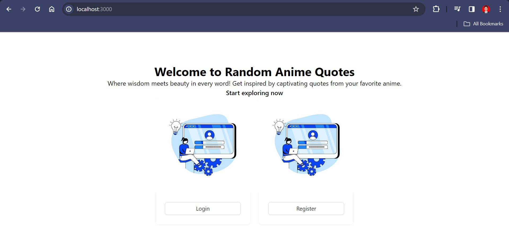
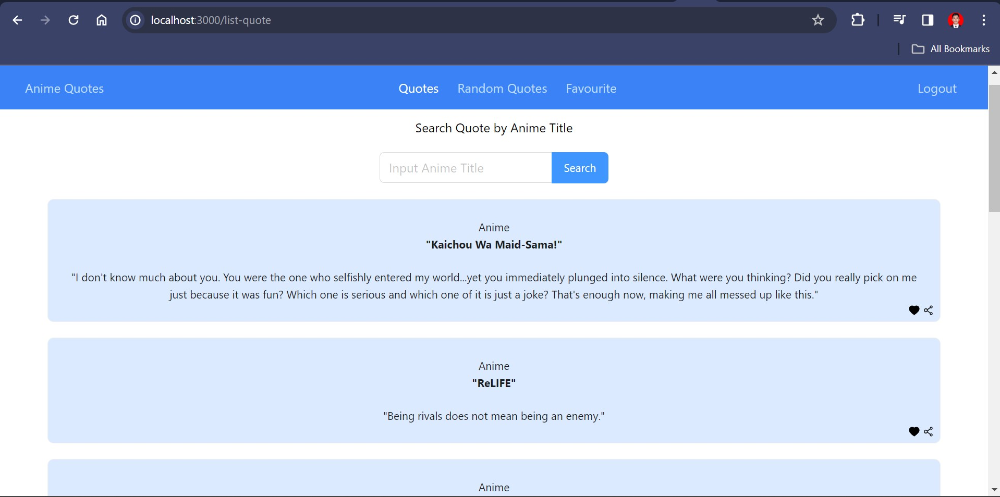
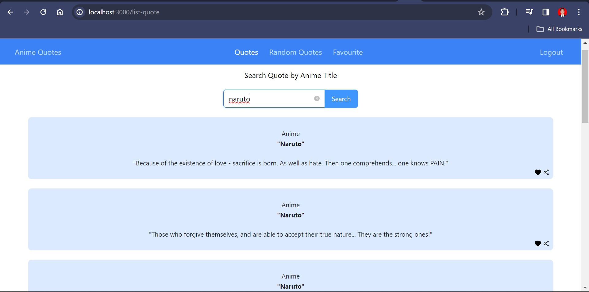
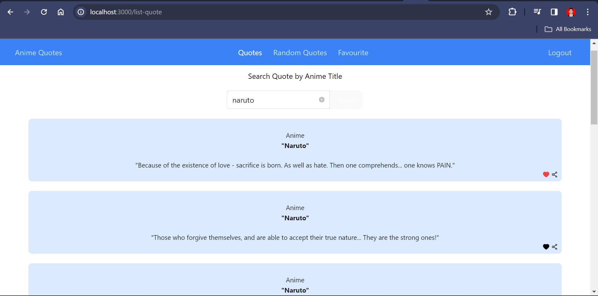
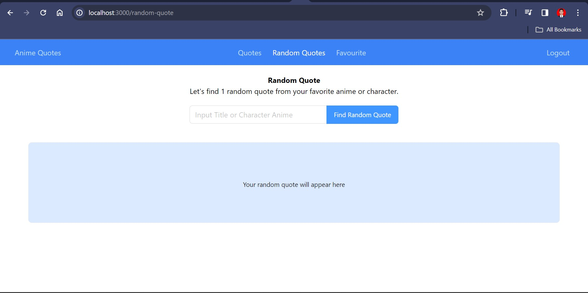
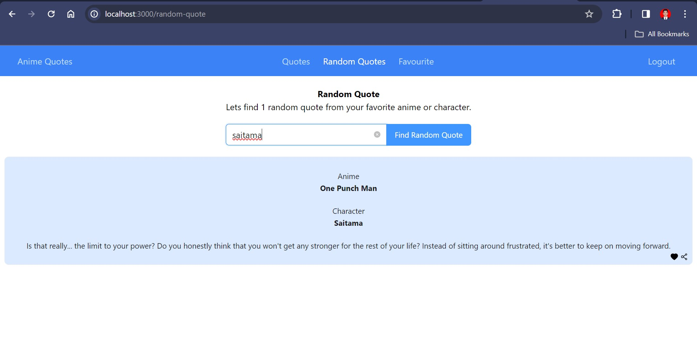
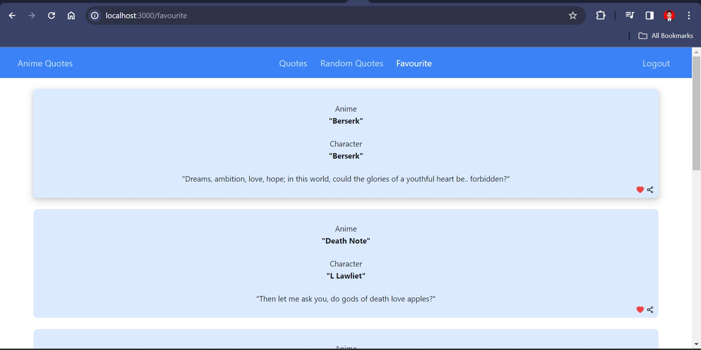

# Random-Quotes

### MVP :

1. Login/Register User
2. Random Quote List
3. Search Random Quote By Anime Title
4. Get 1 Random Quote By Anime Title Or Character
5. Add To Favourite
6. Delete From Favourite
7. Logout User

## Demo :

- Link : -
- Login :

  - email : eve.holt@reqres.in
  - password : cityslicka

- Register :
  - email : eve.holt@reqres.in
  - password : pistol

## 1. Landing Page

Halaman pada path `/` yang akan menampilkan card untuk login atau register user. Pada setiap item nya akan terdapat button untuk mengarahkan ke login maupun register:

## 2. Home Page

Ketika berhasil login maka akan beralih ke halaman pada path `/list-quote` yang akan menampilkan kumpulan `Random Quotes` yang tersedia, dan terdapat feature search random quotes berdasarkan anime, user juga dapat menambahkan quote yang disukai ke daftar favourite. Pada setiap item nya akan terdapat data:

- Judul dari `Anime` tersebut.
- Nama Character dari `Anime` tersebut.
- Quotes dari `Anime atau Character` tersebut.

> Tampilan awal sebelum ada action apapun

> Tampilan ketika ada request search by anime title

> Tampilan setelah berhasil menambahkan ke daftar favourite

## 3. Random Quotes Page

Halaman pada path `/random-quotes` yang akan menampilkan card berisi data dari Quotes. Pada halaman ini terdapat feature untuk melakukan request pencarian quote secara random berdasarkan `Anime Title` atau `Character Anime`

> Tampilan sebelum terdapat request

> Tampilan ketika ada request berdasarkan anime title

> Tampilan ketika ada request berdasarkan character title

## 4. Favourite Page

Halaman pada path `/random-quotes` yang akan menampilkan card berisi data dari Quotes. Pada halaman ini terdapat feature untuk melakukan delete quote from database dan tidak akan ditampilkan lagi pada favourite list.

## 5. Logout 

User dapat melakukan logout untuk keluar dari web dan kembali ke halaman landing page.
